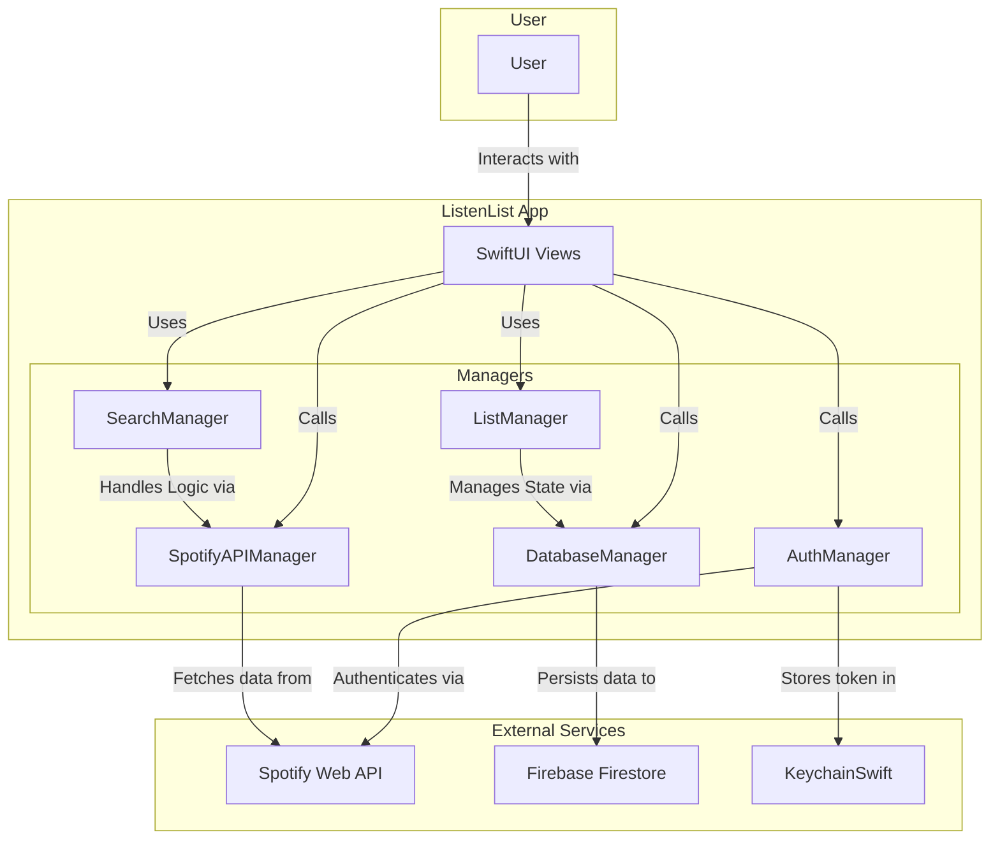

# ListenList

ListenList is a modern iOS application that allows you to curate and manage your personal library of music and audio content. Search for your favorite songs, albums, artists, podcasts, and audiobooks, add them to your "ListenList," and track your journey as you complete them.

## Demo

You can see screen recordings and screenshots of the app [here](https://brandonlc2020.github.io/Portfolio/project/5).

## Features

  * **Comprehensive Multi-Category Search**: Find any song, album, artist, podcast, or audiobook available on Spotify. The search functionality is categorized, allowing you to quickly find exactly what you're looking for with built-in search debouncing for a smooth experience.
  * **Smart Recommendations**: Discover new content powered by your own taste. The app suggests recommendations based on your Spotify top artists/tracks and your own high-rated media.
  * **Personalized "ListenList"**: Add items to your active queue for easy access. Manage your list with intuitive "Edit" modes and optimistic UI updates.
  * **Log as Completed**: Track your progress by logging items as completed. When finishing an item, you can:
    * **Rate it**: Give it a star rating from 1 to 5.
    * **Add Notes**: Leave a personal comment or review for future reference.
  * **Dedicated Completed Tab**: A separate space to browse everything you've finished, with powerful filtering by media type (Song, Album, Podcast, Audiobook).
  * **Flexible Layouts**: Toggle between high-density **Grid View** and detailed **List View** anywhere in the app to suit your preference.
  * **Secure Spotify Authorization**: Securely log in with your Spotify account. The app uses `KeychainSwift` to safely store your credentials and provides a detailed profile view in the Settings.
  * **Cloud Sync**: Powered by Firebase Firestore, your list and completions are synced across your devices and persisted securely in the cloud.

## Technologies Used

  * **SwiftUI**: A fully modern, declarative user interface built for iOS.
  * **Firebase Firestore**: Real-time NoSQL database for cloud synchronization and data persistence.
  * **Spotify Web API**: Integration with the world's largest audio library for search and recommendations.
  * **Async/Await**: Leveraging Swift's modern concurrency model for high-performance networking.
  * **KeychainSwift**: Secure storage for sensitive authentication tokens.

## Architecture



## Dependencies

This project uses the following Swift packages:

  * [firebase-ios-sdk](https://github.com/firebase/firebase-ios-sdk): Integration with Firebase Firestore and Core services.
  * [keychain-swift](https://github.com/evgenyneu/keychain-swift): Secure credential management.

## Getting Started

To run this project, you will need to set up your own Firebase project and Spotify Developer application.

### Prerequisites

  * Xcode 15.0+
  * iOS 17.0+ (Target)
  * A Spotify Developer account
  * A Firebase account

### Setup

1.  **Firebase**

      * Create a new project on the [Firebase Console](https://console.firebase.google.com/).
      * Add an iOS app to your Firebase project.
      * Download the `GoogleService-Info.plist` file and place it in the `frontend/ListenList/` directory.
      * Enable **Firestore Database** in your Firebase project.

2.  **Spotify**

      * Go to the [Spotify Developer Dashboard](https://developer.spotify.com/dashboard).
      * Create a new application.
      * Add your Redirect URI (e.g., `listenlist://callback`) to the application settings.
      * In the project directory, rename `Sample.xcconfig` to `Config.xcconfig` (or create it) inside the `frontend/` folder with the following:
        ```
        SPOTIFY_API_CLIENT_ID = YOUR_SPOTIFY_CLIENT_ID
        SPOTIFY_API_CLIENT_SECRET = YOUR_SPOTIFY_CLIENT_SECRET
        REDIRECT_URI_SCHEME = YOUR_REDIRECT_URI_SCHEME
        REDIRECT_URI_HOST = YOUR_REDIRECT_URI_HOST
        ```
      * Replace the placeholders with your actual Spotify credentials.

3.  **Run the app**

      * Open `ListenList.xcworkspace` in Xcode.
      * Select a target device and run (**⌘R**).

## License

This project is licensed under the MIT License - see the [LICENSE](LICENSE) file for details.
