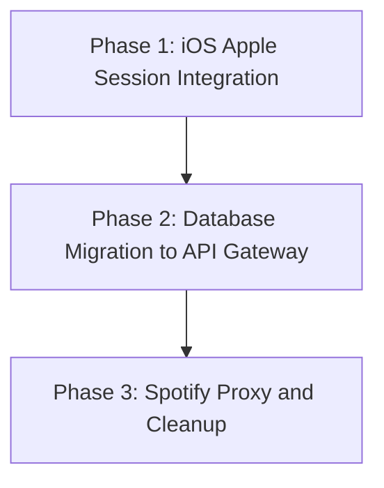

# Migration and Integration Plan: Wiring iOS App to AWS Backend

This document details the transition strategy for moving the **ListenList** iOS frontend from client-side Firebase Firestore & raw Spotify Web API integrations to your unified, serverless AWS backend.

---

## 1. Architectural Changes Overview

The current frontend architecture relies on decentralized services, where the iOS client communicates directly with Firestore (database) and Spotify (auth/search).

```
[Old Client-Direct Flow]
iOS Client ───► Firebase Firestore (Sync queue, log history)
iOS Client ───► Spotify accounts (OAuth, search, recommendations)
```

The new architecture centralizes this orchestration on AWS. The client communicates with the AWS HTTP API Gateway via a custom session token, keeping all client-side secrets secure.

```
[New Centralized AWS Flow]
iOS Client ───► AWS API Gateway ───► AWS Lambda (FastAPI/Mangum)
                                        ├──► DynamoDB (Multi-user Single-Table)
                                        └──► Spotify API (Backend exchange & proxy)
```

---

## 2. Phased Migration Strategy

To avoid breaking compiling states, we will execute the transition in three distinct, isolated phases.



### Phase 1: Establish App Sessions (Sign in with Apple)

We must first authenticate the user inside the iOS app via Sign in with Apple before we can make authorized calls to the new DynamoDB database.

1. **Enable Sign in with Apple in Xcode**:
   - Go to your Project Target -> **Signing & Capabilities** -> Add Capability -> **Sign in with Apple**.
2. **Implement SwiftUI Login View**:
   - Incorporate the native `SignInWithAppleButton` in your login interface.
   - When successful, capture the cryptographic `identityToken` (Data) and convert it to a UTF-8 string.
3. **Establish AuthManager App Sessions**:
   - Modify **[AuthManager.swift](file:///Users/brandonlamer-connolly/code/ListenList/frontend/ListenList/Managers/AuthManager.swift)** to manage your custom app session:
     - Expose a `var userSessionToken: String?` containing your backend JWT.
     - Add `func authenticateWithApple(identityToken: String)` that POSTs to `<AWS_API_GATEWAY_URL>/auth/apple` with the token.
     - On successful response, parse the JWT, store it securely in `KeychainSwift` as `userSessionToken`, set `isAuthenticated = true`, and stop using client-side Spotify state for active queue updates.

---

### Phase 2: Migrate Database Manager (`DatabaseService` Conformance)

Because we abstracted all database operations into the `DatabaseService` protocol, we can change the complete backing database by creating a new manager with **zero changes** to SwiftUI views or business logic.

1. **Implement `AWSDatabaseManager`**:
   - Create `AWSDatabaseManager.swift` conforming to `DatabaseService`:
     ```swift
     class AWSDatabaseManager: DatabaseService {
         let baseURL = URL(string: "https://<api-gateway-id>.execute-api.us-east-1.amazonaws.com")!
         
         private var sessionToken: String {
             return KeychainSwift().get("userSessionToken") ?? ""
         }
         
         // Example implementation of active queue fetching
         func fetchSongs(completion: @escaping ([Song]) -> Void) {
             let url = baseURL.appendingPathComponent("/list/active?entity_type=song")
             var request = URLRequest(url: url)
             request.httpMethod = "GET"
             request.setValue("Bearer \(sessionToken)", forHTTPHeaderField: "Authorization")
             
             URLSession.shared.dataTask(with: request) { data, _, _ in
                 // Decode backend Pydantic models back to Swift domain types
                 // ...
             }.resume()
         }
         // ... implement conformances for add, delete, complete ...
     }
     ```
2. **Swap the Dependency Injection**:
   - In your dependency injection or App initialization file, swap `DatabaseManager.shared` out for `AWSDatabaseManager.shared` as the provider for `ListManager`.
3. **Phase out Firebase SDK**:
   - Remove the `FirebaseCore` and `FirebaseFirestore` packages from Swift Package Manager (SPM).
   - Delete `GoogleService-Info.plist`.
   - Remove `import FirebaseFirestore` imports from Swift source code.

---

### Phase 3: Route Spotify API Calls to Backend Proxy

Now that the database and primary authentication are running on AWS, we transition Spotify account connections and search proxies.

1. **Migrate Spotify Search and Recommendation**:
   - Update **[SpotifyAPIManager.swift](file:///Users/brandonlamer-connolly/code/ListenList/frontend/ListenList/Managers/SpotifyAPIManager.swift)**:
     - Replace calls to `https://api.spotify.com/v1/search` with your API Gateway search endpoint: `<AWS_API_GATEWAY_URL>/search?q=\(query)&type=\(type)`.
     - Pass the backend JWT (`Bearer \(userSessionToken)`) in the `Authorization` header instead of the Spotify client token.
     - The backend automatically resolves the user's Spotify tokens and calls Spotify. The payload returned by the backend maintains exact alignment with Spotify's original JSON layout, so your existing `SearchResponse` decoders will continue working flawlessly.
2. **Transition Spotify OAuth Connections**:
   - Replace the client-side exchange of tokens inside `AuthManager` with the backend redirection:
     - When tapping "Connect Spotify", launch an `ASWebAuthenticationSession` or open the browser pointing to your backend connect page.
     - On callback redirect, hit the backend `/auth/spotify/connect` endpoint passing the authorization code.
     - All refresh tokens and credential lifecycles are now stored securely in DynamoDB rather than inside the iOS Keychain.
3. **Remove Client-Side Spotify Secrets**:
   - Delete client-side properties `SPOTIFY_API_CLIENT_ID` and `SPOTIFY_API_CLIENT_SECRET` from `Config.xcconfig` and Xcode build variables entirely. Your credentials are now 100% hidden within AWS KMS and SSM Parameter Store.

---

## 3. Recommended Phased Roadmap

| Step | Scope | Target | Focus |
| :--- | :--- | :--- | :--- |
| **Step 1** | Auth | `AuthManager.swift` | Integrate Apple identity token exchanges on the backend to receive the JWT. |
| **Step 2** | DB | `AWSDatabaseManager.swift` | Conform `AWSDatabaseManager` to `DatabaseService` using `/list` HTTP endpoints. |
| **Step 3** | Core | Dependency Injection | Swap Firestore for `AWSDatabaseManager` inside `ListManager`. |
| **Step 4** | Egress | `SpotifyAPIManager.swift` | Change direct Spotify searches to hits against backend `/search` proxies. |
| **Step 5** | Cleanup | Dependencies | Uninstall Firebase SPM SDKs and delete config secrets from the iOS code bundle. |
